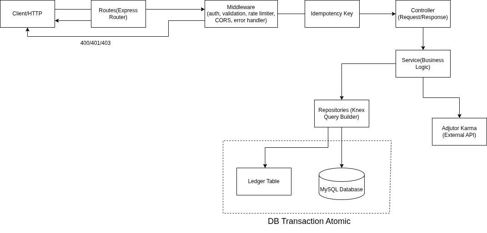
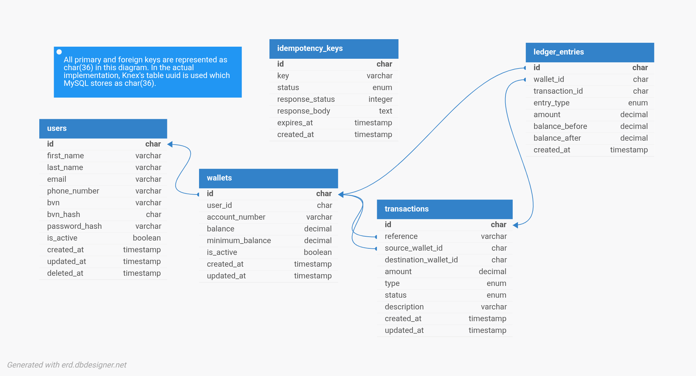

# CredWallet Service

A   production-ready wallet service built to enable users receive, transfer, and withdraw funds for lending operations. CredWallet is designed with financial accuracy at its core — every transaction is traceable, every balance is protected, and bad actors are screened out before they ever touch the system.

---

> **For Reviewers:** A Postman collection covering all endpoints — auth, wallet operations, error cases, and idempotency replay — is included at the root of this repository as `CredWallet.postman_collection.json`. Import it directly into Postman to test the API. Set the `baseUrl` collection variable to the live deployment URL or `http://localhost:5000/api/v1` for local testing. The login request automatically saves the JWT token for all subsequent requests.

## Table of Contents

- [Overview](#overview)
- [Tech Stack](#tech-stack)
- [Architecture](#architecture)
- [Database Design](#database-design)
- [Key Technical Decisions](#key-technical-decisions)
- [API Reference](#api-reference)
- [Getting Started](#getting-started)
- [Running Tests](#running-tests)
- [Known Limitations & Production Considerations](#known-limitations--production-considerations)

---

## Overview

CredWallet is a secure wallet service where users can create accounts, fund their wallets, transfer money to other users, and withdraw funds. It is built specifically for a lending context where money is constantly moving between borrowers and lenders. This means the system must be accurate, safe, and auditable at all times.

Beyond basic wallet operations, CredWallet automatically screens out users who appear on the Lendsqr Adjutor Karma blacklist at the point of registration. A flagged user identified by email or phone number is denied onboarding entirely, protecting the platform and its users from bad actors.

---

## Tech Stack

| Technology          | Role                        | Why                                                                           |
| ------------------- | --------------------------- | ----------------------------------------------------------------------------- |
| NodeJS (LTS)        | Runtime                     | Required by assessment; industry standard for high-throughput APIs            |
| TypeScript (strict) | Language                    | Catches type errors at compile time — non-negotiable for financial systems    |
| Express             | Web framework               | Minimal and flexible; keeps the codebase lean without much framework overhead |
| KnexJS              | Query builder / SQL toolkit | Required by assessment; gives full SQL control with migration support         |
| MySQL               | Database                    | Required by assessment; relational integrity suits financial data             |
| Zod                 | Validation                  | Runtime schema validation with TypeScript type inference at the boundary      |
| bcryptjs            | Password hashing            | Adaptive hashing with configurable salt rounds                                |
| jsonwebtoken        | Authentication              | Faux token-based auth as specified by the assessment                          |
| Helmet              | Security                    | Sets HTTP security headers out of the box                                     |
| express-rate-limit  | Rate limiting               | Protects auth and wallet endpoints from brute force and abuse                 |
| CORS                | Cross-origin                | Controls which origins can access the API                                     |
| uuid                | ID generation               | Cryptographically random UUIDs for security of user data                      |

---

## Architecture

CredWallet follows a layered architecture with clear separation of concerns. Each layer has one job and depends only on the layer below it.



This separation is intentional. Services can be fully unit tested in isolation by mocking repositories. Controllers stay thin. The database is never touched directly from business logic.

---

## Database Design

### ER Diagram



### Tables

**users** — Stores account credentials and profile. `is_active` enables soft account deactivation. `deleted_at` enables soft deletes without destroying audit history.

**wallets** — One wallet per user (enforced by unique constraint on `user_id`). Holds a pre-computed `balance` — a running total kept in sync with the ledger via atomic database transactions — and a `minimum_balance` floor that must always be maintained.

**transactions** — Records every financial event (FUND, TRANSFER, WITHDRAWAL) with a state machine: `PENDING → SUCCESS`. Acts as the user-facing transaction history.

**ledger_entries** — The immutable double-entry audit trail. Every transaction produces balanced debit and credit ledger records. Once written, entries are never updated or deleted.

### Key design decisions

- **UUIDs as primary keys** — Sequential integer IDs are a security risk. An attacker can enumerate resources by incrementing IDs. UUIDs are random and non-guessable.
- **DECIMAL(15, 2) for money** — Floating point types introduce rounding errors. `DECIMAL` stores exact values, which is mandatory for financial data.
- **Minimum balance floor** — A wallet cannot be drained to zero. This is standard practice in lending platforms to maintain operational integrity.
- **Immutable ledger entries** — Ledger entries have no `updated_at` column and no update method in the repository. Corrections are new entries. This is what makes reconciliation trustworthy.

---

## Key Technical Decisions

### 1. Double-Entry Ledger

For a wallet that handles sensitive financial operations, a double-entry ledger ensures all transactions — debits, credits, funds, and withdrawals — are fully traceable and auditable, minimising room for error and reconciliation problems.

This was not required by the assessment spec. It was added because it is a basic requirement for any wallet system handling real funds in a production environment. Every operation writes two immutable ledger entries and records `balance_before` and `balance_after` on each affected wallet. The `balance` column on the wallets table is a pre-computed running total — updated atomically inside the same database transaction that writes the ledger entries. It cannot drift from the ledger because they share the same transaction boundary: if the ledger write fails, the balance update rolls back too, and vice versa. The ground truth is always the ledger; the balance column is what makes reads fast without sacrificing correctness.

| Operation | Entry 1                                      | Entry 2                                          |
| --------- | -------------------------------------------- | ------------------------------------------------ |
| Fund      | CREDIT → user wallet (with balance snapshot) | DEBIT → external source (wallet_id = null)       |
| Transfer  | DEBIT → sender wallet                        | CREDIT → recipient wallet                        |
| Withdraw  | DEBIT → user wallet                          | CREDIT → external destination (wallet_id = null) |

### 2. Race Condition Prevention

The race condition bug is one that catches engineers off-guard and leads to losses in the millions. For a lending business specifically, the risk is higher — money is constantly being borrowed or repaid, meaning concurrent transactions on the same wallet are common.

Without protection, two simultaneous debit requests will both read the same balance, both pass the sufficiency check, and both post — leaving the system with inconsistent balances that cannot be reconciled.

**The fix:** all balance-modifying operations execute inside a single database transaction boundary. Within that boundary, `SELECT FOR UPDATE` acquires a row-level lock on the wallet before reading its balance — no other transaction can read or modify that row until the lock is released. Balance adjustments are written as atomic SQL (`balance = balance + ?`) rather than read-modify-write, ensuring correctness even under concurrent load.

### 3. Deadlock Prevention

A deadlock occurs when wallet A is waiting for a lock held by wallet B, while wallet B is waiting for a lock held by wallet A — both transactions freeze indefinitely.

**The fix:** before acquiring any locks in a transfer, both wallet IDs are sorted alphabetically. Locks are always acquired in the same order regardless of which direction the transfer flows. This guarantees that two concurrent A→B and B→A transfers will never deadlock.

### 4. Transaction State Machine

Every financial operation follows a clean state transition:

```
PENDING → SUCCESS
       ↘ (FAILED — on rollback)
```

The transaction record is created as `PENDING` at the start of the database transaction. After all balance adjustments and ledger entries are confirmed, it is updated to `SUCCESS`. If anything fails, the database transaction rolls back and nothing is persisted — including the `PENDING` record.

### 5. Karma Blacklist — BVN Check

The Lendsqr Adjutor Karma API is checked against the user's **BVN** at registration. If the BVN appears on the blacklist, the account is denied before any data is written. BVN was chosen as the identity anchor because it is a government-issued, non-changeable identifier — unlike email or phone number, a blacklisted user cannot simply register with a different one.

### 6. Idempotency Keys

Network failures happen. A client sends a fund request, the connection drops before the response arrives, and the client retries. Without protection, the wallet gets funded twice.

CredWallet supports optional `Idempotency-Key` headers on all mutating wallet operations (fund, transfer, withdraw). When a key is provided:

- The server checks if this key was already processed
- If yes — the original response is replayed immediately, no operation runs again
- If no — the request is processed, and the successful response is cached against the key for 24 hours

Only successful (2xx) responses are cached. A failed request with the same key can be retried freely after the client resolves the issue.

### 7. Repository Pattern

Repositories are the only layer that touches the database. Services never write SQL. This means business logic can be fully unit tested by mocking repositories — no test database required, no migrations to run, no teardown. It also means the database implementation can be swapped without touching service logic.

---

## API Reference

Base URL: `https://<DEPLOYMENT_URL_PLACEHOLDER>/api/v1`

All wallet endpoints require an `Authorization: Bearer <token>` header.

Mutating wallet operations (fund, transfer, withdraw) accept an optional `Idempotency-Key` header. When provided, the server caches the response for 24 hours and replays it on duplicate requests — preventing double charges on network retries.

### Authentication

#### Register

```
POST /auth/register
```

```json
{
  "first_name": "John",
  "last_name": "Doe",
  "email": "john@example.com",
  "phone_number": "08012345678",
  "bvn": "12345678901",
  "password": "Password123!"
}
```

#### Login

```
POST /auth/login
```

```json
{
  "email": "john@example.com",
  "password": "Password123!"
}
```

### Wallet

#### Fund Wallet

```
POST /wallet/fund
```

```json
{ "amount": 5000 }
```

#### Transfer

```
POST /wallet/transfer
```

```json
{
  "recipient_account_number": "9123456789",
  "amount": 1000,
  "description": "Repayment"
}
```

#### Withdraw

```
POST /wallet/withdraw
```

```json
{
  "amount": 500,
  "description": "Personal withdrawal"
}
```

#### Get Balance

```
GET /wallet/balance
```

#### Get Transactions

```
GET /wallet/transactions?page=1&limit=20
```

| Query Param | Type   | Default | Description                    |
| ----------- | ------ | ------- | ------------------------------ |
| `page`      | number | 1       | Page number                    |
| `limit`     | number | 20      | Results per page (max 100)     |

#### Health Check

```
GET /health
```

---

## Getting Started

### Prerequisites

- Node.js v20+
- MySQL 8+
- npm

### Setup

```bash
# Clone the repository
git clone https://github.com/vector-10/credwallet-service.git
cd credwallet-service

# Install dependencies
npm install

# Copy environment variables
cp .env.example .env
```

### Environment Variables

```env
NODE_ENV=development
PORT=3000

DB_HOST=localhost
DB_PORT=3306
DB_USER=your_db_user
DB_PASSWORD=your_db_password
DB_NAME=credwallet_db

JWT_SECRET=your_jwt_secret_here
JWT_EXPIRES_IN=24h

ADJUTOR_API_KEY=your_adjutor_api_key
ADJUTOR_BASE_URL=https://adjutor.lendsqr.com/v2

ENCRYPTION_KEY=your_64_char_hex_key_here

ALLOWED_ORIGIN=http://localhost:3000
```

### Run Migrations

```bash
npm run migrate:latest
```

### Start the Server

```bash
# Development
npm run dev

# Production
npm run build && npm start
```

---

## Running Tests

```bash
# Run all tests
npm test

# Run with coverage report
npx jest --coverage
```

### Test Coverage

| Layer                                            | Tests                                                    |
| ------------------------------------------------ | -------------------------------------------------------- |
| Services (karma, user, wallet)                   | Registration, login, fund, transfer, withdraw flows      |
| Middlewares (auth, validate, error, idempotency) | Auth guards, validation errors, idempotency replay       |
| Utilities (sanitization, generators)             | Field stripping, type coercion, uniqueness               |

**8 test files, 51 tests.** Both positive and negative scenarios are covered for every business rule — including edge cases like race condition lock failures, self-transfers, minimum balance breaches, blacklisted users, deactivated accounts, and idempotency key replay.

Business logic is unit tested in isolation through repository mocking. Controllers and routes contain no business logic and are better verified through integration tests.

---

## Known Limitations & Production Considerations

These are deliberate decisions made to stay within MVP scope without compromising on the core requirements. They are not oversights.

### Derived Balance (not implemented)

A fully production-grade ledger derives the wallet balance entirely from the sum of settled ledger entries (`SUM(CREDIT) - SUM(DEBIT)`), never storing it directly. The current implementation maintains `balance` as a pre-computed running total, updated atomically alongside every ledger write inside the same database transaction. For this MVP, this is the right trade-off — it keeps reads fast and the logic simple without sacrificing correctness.

### Chart of Accounts (not implemented)

Production fintech systems model asset accounts, liability accounts, revenue accounts, and float/escrow accounts so the books always balance at the company level (`Assets = Liabilities + Equity`). This was intentionally left out — it requires product-level decisions about fee structure, escrow handling, and regulatory reporting that are out of scope for this assessment.

### Multi-Currency (not implemented)

Supporting multiple currencies would require exchange rate management, currency conversion logic, and more complex wallet relationships. CredWallet is scoped to a single currency (NGN) to keep the focus on the core wallet functionality without unnecessary complexity.

### Full Transaction State Machine (partially implemented)

The assessment spec does not require webhook handling or async payment processing. The current `PENDING → SUCCESS` flow is correct for synchronous operations. A full production state machine would add `PROCESSING` and `REVERSED` states for async payment gateway integration and refund flows.

### In-Memory Rate Limiting

The current rate limiter uses in-memory storage, which works correctly for a single-instance deployment. A production multi-instance setup would require a shared store (Redis) to enforce limits across instances.

---

## Live Demo

> `https://<DEPLOYMENT_URL_PLACEHOLDER>`

---
